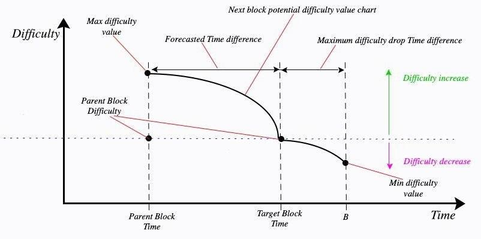

# Energi Gen 3 Difficulty Adjustment Algorithm

### Constant values as used in the algorithm

- K = 10

- M = 1.005 -

- Target Block Gap = 60 seconds

- Maximum difficulty drop time difference =
  -30 (or 30 seconds after the block target)

- Maximum difficulty rise multiplier per block => 1.005^60 = 1.348850153 (
  increases to 130%)

- Minimum difficulty drop multiplier per block => 1.005^-30 = 0.86102973 (drops to
  80%)

## How Difficulty of the next block is obtained

1. An [Exponential Moving Average](doc/ema.md) of `K` blocks time differences is
   computed and used to generate the `Forecasted Time difference` as shown on
   the chart above.

2. Target block time is set as the summation of the parent block time and
   the `Forecasted Time difference`.

3. `Forecasted time difference` ought not to be greater than
   the `Target Block Gap` (the ideal average time it should take to mine one
   block in the chain).

4. To obtain the new block difficulty, we compute a multiplier that increases or
   decreases the `Parent Block Difficulty`.

5. The multiplier is generated via an exponential function where the base M is a
   carefully selected constant and the exponent is the time difference between
   the BlockTarget and NewBlockTime (i.e BlockTarget - NewBlockTime).

6. The exponent can be a positive or a negative number. The negative time
   difference should never be lower than the Maximum difficulty drop time
   difference. Therefore:

> Difficulty multiplier = M ^ max( (BlockTarget - NewBlockTime), maximum difficulty drop time difference )
>
> New Block difficulty = parent difficulty x max( (BlockTarget - NewBlockTime), maximum difficulty drop time difference)
>

## V2 Upgrades

1. The `Forecasted Time difference` is calculated via an exponentially moving
   average (EMA) to help smooth out any difficulty spikes found in the previous
   mined blocks.

2. If the K blocks create an `EMA` time difference less than
   the `Target Block Gap` value, the Forecasted Time difference is reduced to
   that EMA time difference value making it harder to mine blocks.

3. Consequently, if the `EMA` time difference becomes greater than
   the `Target Block Gap` value, the resulting `Forecasted Time difference` is
   capped to the `Target Block Gap` value.

4. The exponential function, base M has been selected to so as help in
   increasing and decreasing the parent difficulty when obtaining the new block
   difficulty. 

5. Base M should always guarantee a small rise or a smaller drop in difficulty.
